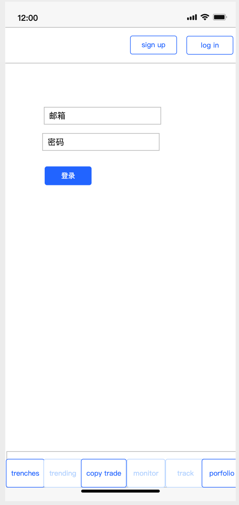
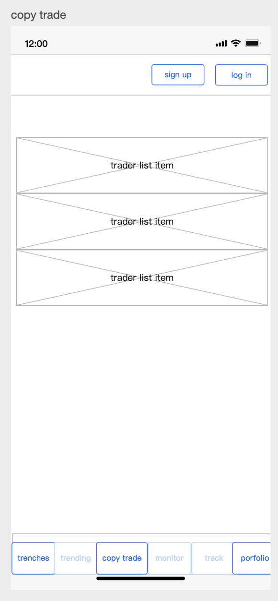
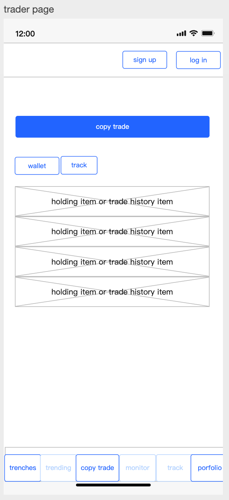
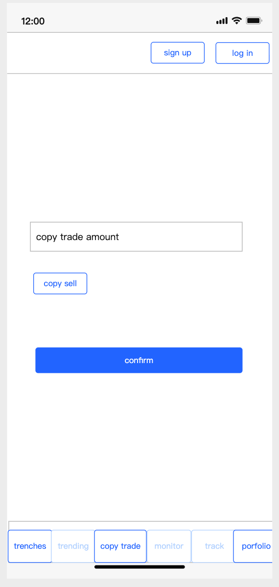
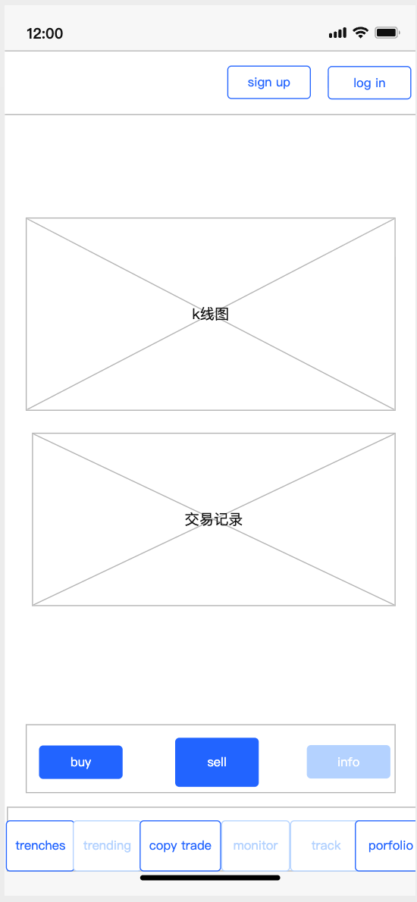
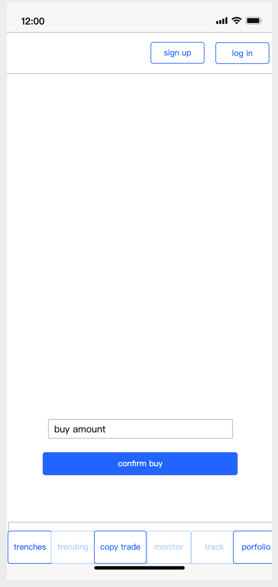
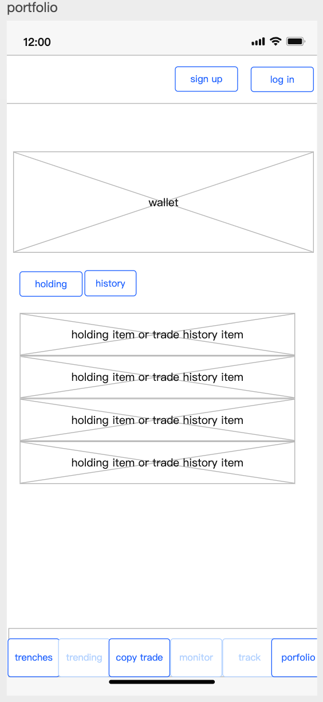

# GMGN.AI（GitHub 托管版）UX 流程文档

## 1. 范围与角色

- **用户（User）**：可注册/登录、查看钱包与资产、浏览市场信息、发起交易、设置跟单。
- **交易员（Trader）**：与用户同源（任何登录用户都可能出现在榜单中）。
- **系统（System）**：展示市场信息与走势，并在交易发生时把跟单规则应用到跟随者。

## 2. 用户旅程图（从进入到完成一次复制交易）

| 阶段 | 触点/页面 | 用户目标 | 系统反馈 | 关键痛点/风险 | 成功指标 |
|---|---|---|---|---|---|
| 进入 | 底部菜单的 Trenches | 浏览市场 & 发现机会 | 列表展示、可点击进入详情 | 信息密度高、首次进入不知从何看起 | 用户能进入详情并继续浏览 |
| 登录 | 右上角 `Log In / Sign Up` | 获得身份 | 登录成功后进入主界面并显示已登录状态 | 表单错误、重复提交、网络波动 | 登录成功且状态展示正确 |
| 寻找跟单 | 底部菜单的 CopyTrade | 找到值得跟单的交易员 | 展示排行榜；点击进入交易员详情 | 自己出现在榜单会困惑 | 能进入交易员详情页 |
| 配置跟单 | 跟单设置抽屉 | 设置买入规则与卖出策略 | 点击 `Confirm` 后保存，并在详情页展示摘要 | 不支持的选项应明确不可用 | 能保存成功并看到摘要 |
| 验证跟单 | TraderProfile | 确认已跟单 & 可取消 | 顶部显示“已跟单 + 策略摘要 + 取消” | 误操作取消、提示不明显 | 能取消并回到未跟单状态 |
| 触发成交 | 详情页 `Buy / Sell` | 产生一次成交以触发跟单 | 成交后列表与资产同步更新；跟随者出现复制成交 | 余额不足、重复触发、用户不理解发生了什么 | 跟随者能看到复制成交出现 |
| 回看结果 | 详情页 / Portfolio | 验证成交与资产变化 | 历史记录与资产展示一致且可对照 | 估值/展示口径不清导致误解 | 用户能对照成交与资产变化 |

## 3. 核心页面线框图（Wireframes）

### 3.1 Auth（登录/注册）

说明：
- 入口为右上角的 `Log In / Sign Up`。
- 登录成功后会进入主界面，页面会显示已登录状态。

关键交互：
- 输入邮箱/密码 → 登录/注册。
- 成功后返回主界面；失败时在表单附近提示原因（如账号/密码错误）。

### 3.2 CopyTrade（榜单） → TraderProfile（详情）

说明：
- 用户从底部 `CopyTrade` 进入榜单页，点击某一行进入交易员详情。

说明：
- 顶部按钮用于发起跟单（未跟单时）或展示“已跟单 + 策略摘要 + 取消”（已跟单时）。

关键交互：
- 点击榜单行 → 进入该交易员详情。
- TraderProfile 顶部按钮：
  - 未跟单：打开 CopyTradeDrawer。
  - 已跟单：展示策略摘要，并提供 Unfollow。

### 3.3 CopyTradeDrawer（跟单设置）

说明：
- 用于配置买入规则与卖出策略。
- 点击 `Confirm` 后会将配置持久化到后端；若命中“双向跟单禁止”，需展示友好错误提示。

关键交互：
- 点击 `Confirm`：保存跟单设置。
- 若保存失败（例如不允许双方互相跟单），在抽屉内提示原因并保持表单不丢失。

### 3.4 TokenDetail（交易与 token trades feed）

说明：
- 详情页展示走势与成交列表；成交列表同时包含“本人成交”和“跟单复制成交”。

说明：
- 成交后应能在详情页的成交列表与个人 `Portfolio` 中看到对应记录。

关键交互：
- Buy/Sell：打开抽屉并提交交易。
- 成交列表：展示最新成交，并在发生复制成交时同步出现。

### 3.5 Portfolio（我的持仓与历史）

说明：
- 展示钱包摘要、资产变化与历史成交，用于验证“复制成交”是否生效。

关键交互：
- Holding/History 切换。
- 页面加载时刷新数据；当发生交易或跟单复制成交后，历史记录与持仓应同步更新。

## 4. 交互流程说明（只描述“做什么/看到什么”）

### 4.1 登录/注册（完成一次登录）
1. 用户点击右上角 `Log In` 或 `Sign Up`。
2. 输入邮箱与密码。
3. 点击提交：
   - 成功：回到主界面，显示已登录状态。
   - 失败：在表单内显示错误提示，并允许用户重试。

### 4.2 配置跟单（完成一次成功跟单）
1. 用户进入 `CopyTrade` 榜单。
2. 点击某交易员进入详情页。
3. 点击 `Copy Trade` 打开设置抽屉。
4. 选择买入规则、输入金额、选择卖出策略。
5. 点击 `Confirm`：
   - 成功：详情页顶部变为“已跟单”，显示策略摘要，并提供 `取消`。
   - 失败：在抽屉中提示原因（例如不允许双方互相跟单），不清空用户已填内容。

### 4.3 触发与验证复制交易（从触发到看到结果）
1. 交易员在详情页进行一次 `Buy` 或 `Sell`。
2. 系统会将该交易同步反映到：
   - 详情页的成交列表（可看到新的成交记录）。
   - 跟单用户的 `Portfolio`（资产/历史记录更新）。
3. 跟单用户回到 `Portfolio` 或 Token 详情页，确认：
   - 历史成交出现一条“复制成交”。
   - 持仓与余额发生对应变化。

